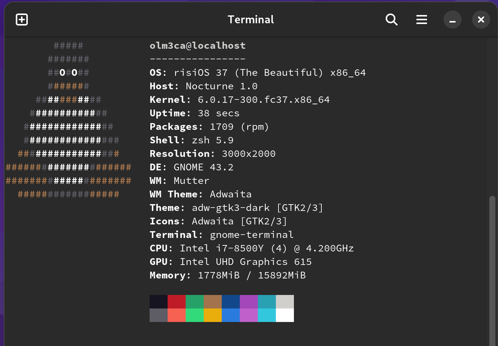
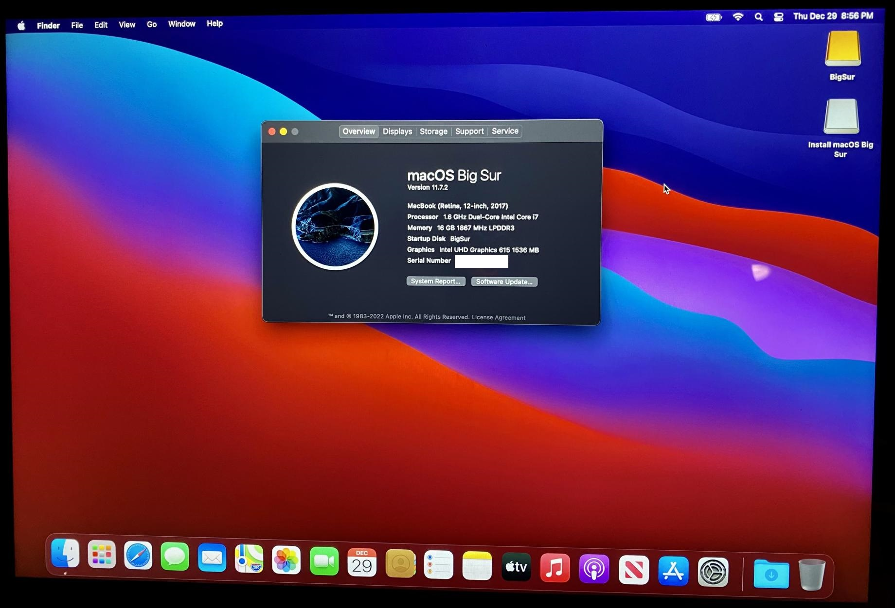

# Google Pixel Slate
It's a Slate, a Surface, MacOS iPad, and a full Linux tablet:
Multiboot guide for ChromeOS, GNU/Linux, Windows 10/11 and MacOS. 

|[RisiOS](https://risi.io/)      |[Big Sur](https://www.reddit.com/r/hackintosh/comments/zn5j7x/google_pixel_slate_on_mojave/)       |
|------------|-------------|
|||

### Disclaimer

The process described in this document could cause irreversible damage to your device. I accept absolutely no responsibility for the consequences of anyone choosing to follow or ignore any of the instructions in this document, and make no guarantees about the quality or effectiveness of the procedures in this repo.

### Pixel Slate (2019) Hardware
Specs:
-  CPU: Intel m3-8100Y, i5-8200Y, or i7-8500Y (Amberlake)
-  GPU: Intel UHD 615
-  RAM: 4, 8 or 16GB 
-  Audio: kblmax98373
-  Wifi/BT Card: Intel 7265
-  Touchpad: Synaptics TM3579-001 (only works on Linux and Chrome OS). 
-  SSD: 64,128 or 256GB eMMC.

### OS Compatibility Current Status
Dual booting native ChromeOS and Fedora 37 (or my favorite, [RisiOS](https://risi.io/)) is the best overall experience and only requires RW_Legacy boot which is very easy to enable. With [MrChromebox's](https://mrchromebox.tech/) full UEFI coreboot, Windows 10/11 has the best overall hardware support outside of ChromeOS with only the fingerprint scanner and camera as nonfunctional. Mac OS works with accelerated graphics and touchscreen, but screen brightness is 100% and it is missing audio and other functionality. Battery and power management work for all. [Brunch](https://github.com/sebanc/brunch) works with sound, as noted below. Camera and fingerprint reader do not work. 


| Hardware           | RisiOS / Fedora 37| Mac OS Big Sur     | Windows 10/11   | Brunch* (see notes below) |
|--------------------|----------------------|---------------------|-----------------|-------------------|
| WiFi               | Working              | Working             | Working         | Working		|
| Bluetooth          | Working              | Working             | Working	        | Working		|
| Suspend / Sleep    | Working              | Not Working         | Working         | Working* 		|
| Touchpad           | Working	            | Working             | Working         | Working           |
| Graphics Accel.    | Working              | Working	            | Working    	    | Working 		|
| Sound              | Working          | Not Working         | Working	            | Working* |
| Keyboard backlight | Working              | Not Working         | Working     | Working		|
| Touchscreen        | Working              | Working             | Working  | Working 		|
| Screen brightness  | Working		          | Not Working	        | Working	    | Working		|


## Part 1: Internal install dual-boot full GNU/Linux and ChromeOS for the Pixel Slate:

This first option may appeal to those who do not have a SuzyQ cable and / or are not interested in making modifications to the firmware as described in Part 2 below. ChromeOS uses a standard layout for partitions on the internal drive and they can be carefully modified to allow for extra space for a Linux-based OS. In my case I set aside 100GB for ChromeOS and now have a 124GB partition for RisiOS. 

Switching between systems is a simple reboot followed by CTRL+D (ChromeOS) or CTRL+L (Fedora). And if anything breaks, you can quickly start over with a ChromeOS recovery USB.

- Start with a fresh install of ChromeOS 107 using a recovery from [ChromiumDash](https://chromiumdash.appspot.com/serving-builds?deviceCategory=ChromeOS), search for Nocturne and download 107. Make a recovery drive using the Chromebook Recovery Utility. 
- Turn on Developer Mode. For the Slate, [this guide](https://www.reddit.com/r/chromeos/comments/a1vaxq/tutorial_how_to_enabled_developer_mode_on_pixel/) may be helpful. 
- I highly recommend reading about the ChromeOS partition structure described in detail in [Saagar Jha's excellent guide.](https://saagarjha.com/blog/2019/03/13/dual-booting-chrome-os-and-elementary-os/)
- You can edit the partitions manually following that guide or, as I did, by using the [chromeos-resize](https://github.com/ethanmad/chromeos-resize) utility which worked perfectly on the Slate.
- In ChromeOS 107, log in as Guest and CTRL+ALT+T to get to crosh, then follow either the manual or script procedures to set up your partitions. I recommend a KERN-C partition of at least 512mb for the /boot partition, in my case I used 600mb to be safe. You can decide how much space to allocate for ChromeOS and ROOT-C (Linux).
- After your partitions have been resized, reboot and let ChromeOS repair itself. On reboot, log in and update to the latest ChromeOS version. Finally, reboot, and double check that your disk space is still correct with `sudo cgpt show /dev/mmcblk0`
- Create a [RisiOS](https://risi.io/) or [Fedora 37](https://getfedora.org/en/workstation/download/) bootable USB. You can download it in ChromeOS, change .iso to .bin and flash it to a USB drive using the Chromebook Recovery Utility.
- Go to [MrChromebox's website](https://mrchromebox.tech/#fwscript) and get familiar with it. In this case, run the script and enable RW_Legacy boot. That's all we need to do, no other modifications.
- Now you can reboot, plug in the RisiOS/Fedora USB (or distro of your choosing) and press CTRL+L at boot to go to seabios. You will need to quickly press ESC to select options to boot from, and choose your USB drive to boot the OS installer.
- Connect to wifi and start the installer. After selecting language and keyboard layout, the installer will ask about the partitions. 
    - Important: Before partitioning, there is a "Full disk summary and bootloader" option in the bottom left. Select that, then select the internal eMMC drive. Click on "Do not install boot loader" - we will install grub after, but not yet. 
    - Choose the Advanced Custom Blivet-GUI partitioning tool.
    - Select partition 6 (KERN-C) and format as ext4, mount point is /boot
    - Select partition 7 (ROOT-C) and format as ext4, mount point is /
    - If you get a warning about a missing bios 1mb partition, go back to the "Full disk summary and bootloader" step and make sure you have chosen to not install boot loader. It won't proceed past this warning otherwise. 
    - After installation, quit the installer but don't reboot. Now we'll install the bootloader with:
        - `sudo mkdir /mnt/boot`
        - `sudo mount /dev/mmcblk0p6 /mnt/boot`
        - `sudo grub2-install --boot-directory=/mnt/boot /dev/mmcblk0 --force` - this should succeed with no errors.
        
Now you can reboot and select CTRL+L to boot into Fedora/RisiOS or CTRL+D to boot into ChromeOS. 

### Audio
By default audio will not work at all, but by installing a custom kernel and copying topology and firmware files using the super helpful Eupnea audio script, the speakers will work. The microphone is currently non-functional.

#### Custom Kernel install
1. Download [this custom kernel](https://www.dropbox.com/s/4b225bh5ax63n75/cros%20kernel.zip?dl=0)
2. `sudo cp vmlinuz /boot/` and rename it to vmlinuz-5.10.164-gddc0853e897c
3. `sudo tar xf modules-stable.tar.xz -C /lib/modules`
4. `sudo dracut --kver 5.10.164-gddc0853e897c initramfs-5.10.164-gddc0853e897c.img`
5. `sudo chmod +x /boot/vmlinuz-5.10.164-gddc0853e897c`

#### Audio firmware files
1. Run Eupnea audio scripts: https://github.com/eupnea-linux/audio-scripts

## Part 2: Full UEFI boot for Windows, MacOS and Brunch, disabling Firmware Write Protect

To proceed, you'll need to open the write protect for this machine's CR50 security chip. Start by [reading this wiki by MrChromebox](https://wiki.mrchromebox.tech/Firmware_Write_Protect) to understand what you'll be doing. For this tablet, there is really only one option: You have a SuzyQable CCD Debugging cable, or you can make one. Otherwise if you're really good at hardware repair you can [open up the Slate](https://www.ifixit.com/Device/Google_Pixel_Slate) and disconnect the battery, I guess. Then skip to Part 2 below:

- A SuzyQable CCD Debugging cable (no longer available for sale).
- A USB-A to USB-C adapter
- You must be in developer mode, so read [this guide](https://www.reddit.com/r/chromeos/comments/a1vaxq/tutorial_how_to_enabled_developer_mode_on_pixel/).
- Read the [Firmware Write Protect](https://wiki.mrchromebox.tech/Firmware_Write_Protect) wiki article again. Start at the section entitled "Disabling WP on CR50 Devices via CCD."
- The device will ask you to press the power button several times during 3 minutes. Once finished, it will power off.
- Upon booting again, it will switch back to regular mode. You must shutdown and switch back over to Developer Mode. Same procedure as before and another 30 minutes of waiting.
- Verify at the end that WP has been disabled with `sudo gsctool -a -I`  
- UEFI Firmware Utility Script: MrChromebox's Coreboot installer. This next step is to get Coreboot installed so we can install other operating systems.

    - Read MrChromebox's install [instructions carefully.](https://mrchromebox.tech/#fwscript)
    - The latest firmware supports the Pixel Slate. Run the script provided and follow each step carefully.
    - Follow the on-screen prompts and make sure you save a backup of the stock firmware!

## Part 3: Windows 10/11 (with working audio, thanks to [Coolstar](https://coolstar.org/)!)
For Windows, boot from the installer USB, and you may need a driver utility beyond what Windows Update can find on its own. Driver Booster is one option, or try [Snappy](https://www.snappy-driver-installer.org/). 
- Don't install any audio drivers. Use Coolstar's driver for that: visit [Patreon](https://www.patreon.com/coolstar) and the [Driver portal](https://coolstar.org/chromebook/driverlicense/) for more details, or visit the [Chrultrabook subreddit.](https://www.reddit.com/r/chrultrabook/)
- Everything will work except the camera and fingerprint reader as there are no drivers for either.


## Part 4: MacOS Catalina / Big Sur 
Download the lastest version of Opencore. Catalina or Big Sur is recommended - either will work installed on an external SSD, but Big Sur can be picky about what type of SSD you have, so be aware it may be more challenging.
 
1. Download and set up your Mac OS X USB install media. [gibMacOS](https://github.com/corpnewt/gibMacOS) 
    - Before you make the install USB, make sure it is formatted as Mac OS Extended (Journaled) with GUID Partition Map.
    - To create the installer on a Mac in Terminal, follow [Apple's guide](https://support.apple.com/en-us/HT201372)

2. Create your EFI based on the latest OC Guide for [this KabyLake generation](https://dortania.github.io/OpenCore-Install-Guide/config-laptop.plist/kaby-lake.html).
    
3. When the MacOS install media is ready, mount the EFI partition with the [MountEFI](https://github.com/corpnewt/MountEFI) utility and copy the contents of the latest EFI linked above into this partition.
    - Make sure to copy the entire contents of the EFI above, starting from the EFI folder itself. So inside the EFI partition it should start with EFI, followed by BOOT and OC folders, etc. 

4. Now, boot from the installer. In Disk Utility, go to Show All Devices in the top left, and then select your target external SSD, the entire drive (or a partition) to format it as APFS.
    - After about 10 minutes or so, it will reboot. Go back into the boot menu and select your install media. In the opencore boot menu you should now see "Mac OS Install" as a menu item. Select that to continue the installation. 
    - The second phase of the installation will continue for about 15-20 minutes. 
  
5. Before you can boot from the new MacOS installation, you will need to copy the EFI to your target external SSD drive using the same procedure from step 3.  

6. Read the [OpenCore guide](https://dortania.github.io/OpenCore-Install-Guide/) on how to improve this hackintosh build and contribute here.

7. In the future, a eMMC driver may be developed for installation to the internal drive. More details will be shared if it succeeds. 

## Part 5: Brunch

Brunch now works with audio - the camera and fingerprint reader do not work, as expected. To install Brunch, follow the official guide at https://github.com/sebanc/brunch and download the latest stable version. Then download the latest NOCTURNE recovery from chromiumdash. 

Notes: Sleep is currently not working, looking for a fix.

To fix sound: in /etc/modprobe.d and add `avs.conf` with the following line:
`options snd-intel-dspcfg dsp_driver=4` and reboot.

Or, to make this more permanent and to survive OS updates, see the below GRUB example for the kernel command line entry:

```
img_part=/dev/mmcblk0p4
	img_path=/chromos.img
	search --no-floppy --set=root --file $img_path
	loopback loop $img_path
	linux (loop,7)/kernel-macbook boot=local noresume noswap loglevel=7 disablevmx=off snd-intel-dspcfg.dsp_driver=4 \
		cros_secure cros_debug options=enable_updates,native_chromebook_image loop.max_part=16 img_part=$img_part img_path=$img_path \
		console= vt.global_cursor_default=0 brunch_bootsplash=default 
	initrd (loop,7)/lib/firmware/amd-ucode.img (loop,7)/lib/firmware/intel-ucode.img (loop,7)/initramfs.img
```
