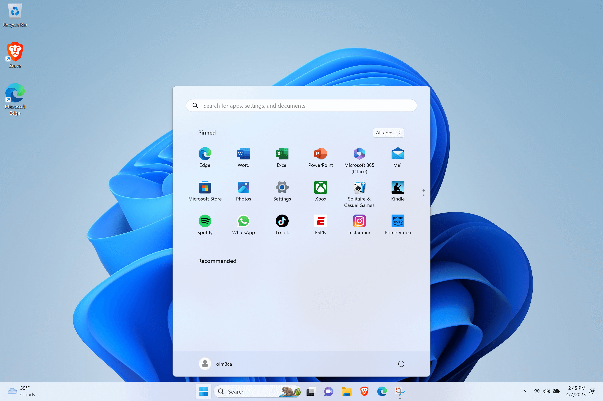

# Google Pixel Slate
It's a Slate, a Surface, MacOS iPad, and a full Linux tablet:
Multiboot guide for ChromeOS, GNU/Linux, Windows 10/11 and MacOS. 

|[GNU/Linux](https://getfedora.org/)      |[MacOS](https://www.reddit.com/r/hackintosh/comments/zn5j7x/google_pixel_slate_on_mojave/)       | [Windows](https://coolstar.org/chromebook/windows.html) |
|------------|-------------|-------------|
|||

### Disclaimer

The process described in this document could cause irreversible damage to your device. I accept absolutely no responsibility for the consequences of anyone choosing to follow or ignore any of the instructions in this document, and make no guarantees about the quality or effectiveness of the procedures in this repo.

### Pixel Slate (2019) Hardware
Specs:
-  CPU: Intel m3-8100Y, i5-8200Y, or i7-8500Y (Amberlake)
-  GPU: Intel UHD 615
-  RAM: 4, 8 or 16GB 
-  Audio: kblmax98373
-  Wifi/BT Card: Intel 7265
-  Touchpad: Synaptics TM3579-001  
-  SSD: 64,128 or 256GB eMMC.

### OS Compatibility Current Status
This guide covers a few options for installing the operating system of your choice:
- [RW_Legacy](https://mrchromebox.tech/#bootmodes) dual boot: No SuzyQ cable needed, very easy to enable. Native ChromeOS and Fedora work very well with few limitations (or try [RisiOS](https://risi.io/)). 
- [Full UEFI boot](https://mrchromebox.tech/#bootmodes) via MrChromebox's coreboot: Windows, Linux and Brunch: all hardware works except the fingerprint scanner and camera - in Windows, Coolstar is currently working on drivers for those. Mac OS (now with working internal eMMC storage installation!) works with accelerated graphics and touchscreen, but screen brightness is 100% and it is missing audio and other functionality. Battery and power management work for all. 


| Hardware           | Fedora| MacOS     | Windows 10/11   | [Brunch*](https://github.com/sebanc/brunch) |
|--------------------|----------------------|---------------------|-----------------|-------------------|
| WiFi               | Working              | Working             | Working         | Working		|
| Bluetooth          | Working              | Working             | Working	        | Working		|
| Suspend / Sleep    | Working              | Not Working         | Working         | Working 		|
| Touchpad           | Working	            | Working             | Working         | Working           |
| Graphics Accel.    | Working              | Working	            | Working    	    | Working 		|
| Sound w/ Mic       | Working          | Not Working         | Working	            | Working |
| Keyboard backlight | Working              | Not Working         | Working     | Working		|
| Touchscreen        | Working              | Working             | Working  | Working 		|
| Screen brightness  | Working		          | Works with BetterDisplay	        | Working	    | Working		|
| Camera	| Not working	| Not Working | Work-in-progress | Not Working |
| Fingerprint reader | Not working	| Not Working | Work-in-progress | Not Working |
| Sleep 	| Working	| Not Working 	| Working	| Not Working |

## Part 1: Internal install dual-boot full GNU/Linux and ChromeOS for the Pixel Slate:

For those who do not have a SuzyQ cable and / or are not interested in making modifications to the firmware as described in Part 2 below, try this method. ChromeOS uses a standard layout for partitions on the internal drive and they can be carefully modified to allow for extra space for a Linux-based OS. In my case I set aside 100GB for ChromeOS and now have a 124GB partition for RisiOS. 

Switching between systems is a simple reboot followed by CTRL+D (ChromeOS) or CTRL+L (Linux). And if anything breaks, you can quickly start over with a ChromeOS recovery USB.

- Start with a fresh install of ChromeOS using a recovery from [ChromiumDash](https://chromiumdash.appspot.com/serving-builds?deviceCategory=ChromeOS), search for Nocturne. Make a recovery drive using the Chromebook Recovery Utility. 
- Turn on Developer Mode. For the Slate, [this guide](https://www.reddit.com/r/chromeos/comments/a1vaxq/tutorial_how_to_enabled_developer_mode_on_pixel/) may be helpful. 
- I highly recommend reading about the ChromeOS partition structure described in detail in [Saagar Jha's excellent guide.](https://saagarjha.com/blog/2019/03/13/dual-booting-chrome-os-and-elementary-os/)
- You can edit the partitions manually following that guide or, as I did, by using the [chromeos-resize](https://github.com/ethanmad/chromeos-resize) utility which worked perfectly on the Slate.
- In ChromeOS, log in as Guest and CTRL+ALT+T to get to crosh, then follow either the manual or script procedures to set up your partitions. I recommend a KERN-C partition of at least 512mb for the /boot partition, in my case I used 600mb to be safe. You can decide how much space to allocate for ChromeOS and ROOT-C (Linux).
- After your partitions have been resized, reboot and let ChromeOS repair itself. On reboot, log in and update to the latest ChromeOS version. Finally, reboot, and double check that your disk space is still correct with `sudo cgpt show /dev/mmcblk0`
- Create a [RisiOS](https://risi.io/) or [Fedora 37](https://getfedora.org/en/workstation/download/) bootable USB. You can download it in ChromeOS, change .iso to .bin and flash it to a USB drive using the Chromebook Recovery Utility.
- Go to [MrChromebox's website](https://mrchromebox.tech/#fwscript) and get familiar with it. In this case, run the script and enable RW_Legacy boot. That's all we need to do, no other modifications.
- Now you can reboot, plug in the RisiOS/Fedora USB (or distro of your choosing) and press CTRL+L at boot to go to seabios. You will need to quickly press ESC to select options to boot from, and choose your USB drive to boot the OS installer.
- Connect to wifi and start the installer. After selecting language and keyboard layout, the installer will ask about the partitions. 
    - Important: Before partitioning, there is a "Full disk summary and bootloader" option in the bottom left. Select that, then select the internal eMMC drive. Click on "Do not install boot loader" - we will install grub after, but not yet. 
    - Choose the Advanced Custom Blivet-GUI partitioning tool.
    - Select partition 6 (KERN-C) and format as ext4, mount point is /boot
    - Select partition 7 (ROOT-C) and format as ext4, mount point is /
    - If you get a warning about a missing bios 1mb partition, go back to the "Full disk summary and bootloader" step and make sure you have chosen to not install boot loader. It won't proceed past this warning otherwise. 
    - After installation, quit the installer but don't reboot. Now we'll install the bootloader with:
        - `sudo mkdir /mnt/boot`
        - `sudo mount /dev/mmcblk0p6 /mnt/boot`
        - `sudo grub2-install --boot-directory=/mnt/boot /dev/mmcblk0 --force` - this should succeed with no errors.
        
Now you can reboot and select CTRL+L to boot into Fedora/RisiOS or CTRL+D to boot into ChromeOS. You may wish to edit your grub menu to add an entry for this new ChromeOS kernel. The method I use is:
 - `sudo su`
 - `cd /boot/loader/entries/`
 - `touch chromeos.conf`
 - Then simply copy one of the existing entries to your new entry (chromeos.conf) but change it to boot from vmlinuz-5.10.165 and initramfs-5.10.165.img. 

Final Step: to set up audio, follow the instructions in Part 3 below.


## Part 2: Full UEFI boot

To proceed, you'll need to open the write protect for this machine's CR50 security chip. Start by [reading this wiki by MrChromebox](https://wiki.mrchromebox.tech/Firmware_Write_Protect) to understand what you'll be doing. For this tablet, there is really only one option: You have a SuzyQable CCD Debugging cable, or you can make one. 

- A SuzyQable CCD Debugging cable (or make your own)
- A USB-A to USB-C adapter
- Developer mode enabled
- Follow the [Firmware Write Protect](https://wiki.mrchromebox.tech/Firmware_Write_Protect) section entitled "Disabling WP on CR50 Devices via CCD."
- Verify at the end that WP has been disabled with `sudo gsctool -a -I`  
- In crosh shell, run the [UEFI Firmware Utility Script](https://mrchromebox.tech/#fwscript)
- Make sure you save a backup of the stock firmware.

## Part 3: Linux and Audio

Install the distro of your choice but note: by default audio will not work on mainline kernels. By installing a custom ChromeOS kernel and copying topology and firmware files using the helpful [Eupnea](https://eupnea-linux.github.io/) Project's audio script, the speakers and microphone now work.

#### Custom Kernel install 
For best results, use this on Fedora or RisiOS. To build your own, follow the [Create your own custom kernel guide.](https://github.com/olm3ca/Pixel-Slate/blob/main/Create%20your%20own%20custom%20kernel.md)

1. Download [this custom kernel](https://drive.google.com/file/d/1AayV-pxhpCcb4LhDQeA8mdsLi8-HVY3S/view?usp=share_link)
2. `sudo tar xf modules.tar.xz -C /lib/modules`
3. `sudo cp vmlinuz-chromeos /boot/vmlinuz-5.10.165`
4. `cd /boot`
5. `sudo dracut --kver 5.10.165+ initramfs-5.10.165.img`
6. `sudo chmod +x /boot/vmlinuz-5.10.165`

Note: on first boot with the new kernel, the screen may be upside down. To fix:
```
sudo su
cd /etc/udev/hwdb.d
wget https://raw.githubusercontent.com/eupnea-linux/depthboot-builder/main/configs/hwdb/61-sensor.hwdb
systemd-hwdb update
reboot
```

#### Audio firmware files
1. Run Eupnea audio scripts: https://github.com/eupnea-linux/audio-scripts

#### A note on the microphone
The Pixel Slate microphone in RW_Legacy boot will be fully functional following this method. In full UEFI boot, the speakers will work but not the microphone. This is because the mic uses 4 channel audio, and the UEFI firmware currently limits that to 2 channels. You can update this with a test build from MrChromebox to enable all 4 channels, but it will potentially cause problems in Windows if that matters to you. 


## Part 4: Windows 10/11 (with working audio and other driver development, thanks to [Coolstar](https://coolstar.org/)!)

For Windows, boot from the installer USB, and you may need a driver utility beyond what Windows Update can find on its own. Driver Booster is one option, or try [Snappy](https://www.snappy-driver-installer.org/). 
- Don't install any audio drivers. Use Coolstar's driver for that: visit [Patreon](https://www.patreon.com/coolstar) and the [Driver portal](https://coolstar.org/chromebook/driverlicense/) for more details, or visit the [Chrultrabook subreddit.](https://www.reddit.com/r/chrultrabook/)
- The camera and fingerprint reader are in development, updates will be posted here.


## Part 5: MacOS
 Start first with reading the [OpenCore Guide](https://dortania.github.io/OpenCore-Install-Guide/config-laptop.plist/kaby-lake.html). Download and set up your Mac OS X USB install media. [gibMacOS](https://github.com/corpnewt/gibMacOS). Before you make the install USB, make sure it is formatted as Mac OS Extended (Journaled) with GUID Partition Map. To create the installer on a Mac in Terminal, follow [Apple's guide](https://support.apple.com/en-us/HT201372)

2. Create your EFI based on the latest OC Guide for [this KabyLake generation](https://dortania.github.io/OpenCore-Install-Guide/config-laptop.plist/kaby-lake.html).
    
3. When the MacOS install media is ready, mount the EFI partition with the [MountEFI](https://github.com/corpnewt/MountEFI) utility and copy the contents of your EFI.
    - Make sure to copy the entire contents of the EFI above, starting from the EFI folder itself. So inside the EFI partition it should start with EFI, followed by BOOT and OC folders, etc. 
    - You will need the following customizations in order to make this EFI bootable: 
    - [EmeraldSDHC kext](https://github.com/acidanthera/EmeraldSDHC) 
    - You will need to run SSDTTime in either Windows or Linux to produce the following IRC patch: FixHPET option, press C, then drag the ssdt it makes into your ACPI folder, then add the patches to your config.plist. 
    - add the following boot args in your config.plist: `-igfxnotelemetryload` for iGPU to work with full acceleration

4. Now, boot from the installer. In Disk Utility, go to Show All Devices in the top left, and then select the internal eMMC (either the entire drive or a partition) to format it as APFS.
    - After about 15 minutes or so, it will reboot. Do not force reboot at any point - allow it to continue even if it says "1 minute remaining" for an extended period. 
    - Go back into the boot menu and select your install media. In the opencore boot menu you should now see "Mac OS Install" as a menu item. Select that to continue the installation. 
    - The second phase of the installation will continue for about 20-30 minutes. 
    - It will reboot, and you may need to boot 1-2 more times with either "Mac OS Install" or the name of your hard drive in OC before Monterey is fully installed.
  
5. Before you can boot from the new MacOS installation, you will need to copy the EFI to your internal EFI partition using the same procedure from step 3.  

6. Read the [OpenCore guide](https://dortania.github.io/OpenCore-Install-Guide/) on how to improve this hackintosh build and contribute here.

7. For now, you can use [BetterDisplay](https://github.com/waydabber/BetterDisplay) for screen brightness. 


## Part 6: Brunch 107 

Brunch works with audio on v107 with ChromeOS 107. Newer versions of Brunch and ChromeOS break sound due to kernel incompatibility at the moment. The camera and fingerprint reader do not work, as expected. To install Brunch, follow the official guide at https://github.com/sebanc/brunch and download version 107. Then download NOCTURNE recovery 107 from chromiumdash. 

Notes: Sleep is currently not working, looking for a fix. For now, disable sleep in settings.

To fix sound: in /etc/modprobe.d and add `avs.conf` with the following line:
`options snd-intel-dspcfg dsp_driver=4` and reboot.

Or, to make this more permanent and to survive OS updates, see the below GRUB example for the kernel command line entry (edit this to point to the correct partition you are using on /dev/mmcblk0p#):

```
img_part=/dev/mmcblk0p4
	img_path=/chromos.img
	search --no-floppy --set=root --file $img_path
	loopback loop $img_path
	linux (loop,7)/kernel-chromebook-5.10 boot=local noresume noswap loglevel=7 disablevmx=off snd-intel-dspcfg.dsp_driver=4 \
		cros_secure cros_debug options=enable_updates,native_chromebook_image loop.max_part=16 img_part=$img_part img_path=$img_path \
		console= vt.global_cursor_default=0 brunch_bootsplash=default 
	initrd (loop,7)/lib/firmware/amd-ucode.img (loop,7)/lib/firmware/intel-ucode.img (loop,7)/initramfs.img
```
